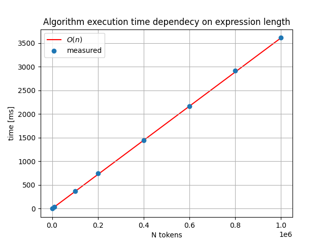

# Implementation document

## Structure

Application's structure is shown below:  

User interface, [UI](../src/ui/ui.py), contains simple command line user interface. User interface doesn't contain application logic. User interface is only communicating with CalculatorService.

### Services

Description of the applications services.

[CalculatorService](../src/services/calculator_service.py):
- executes the high level logic of the application
- stores user defined variables
- evaluates postfix notations
- executes basic mathematical operations and functions (sin(.) etc.) 

[ValidationService](../src/services/validation_service.py):
- offers various validation/checking methods for other services, e.g:
    - validating that the experssion starts with legal token
    - validating that user defined variable names and values are legal
    - etc.

[ParserService](../src/services/parser_service.py):
- parses the expression, which user has given, into tokens which then are processed by the Shunting Yard algorithm
    - also prepares the expression prior to parsing, e.g.:
        - removes whitespaces
        - converts possible variables into their values
        - etc.

[ShuntingYardService](../src/services/shunting_yard_service.py):
- implements the actual Shunting Yard algorithm which parses the expression in infix notation into postfix notation
- algorithm uses two data structures: stack and queue (these are defined in their own classes, see below)

### Entities

Entities classess are responsible for holding data, they shouldn't contain complex logic.  

[Expression](../src/entities/expression.py):
- holds information of the user given expression and it's different forms:
    - raw input from the user
    - expression parsed into tokens
    - tokens in postfix notation
    - the value of the solved expression

[OperatorStack](../src/entities/operator_stack.py):
- Shunting Yard algorithm uses stack data structure to store expression's operators during algortihm execution
- this class holds the data itself and also implements helper methods, e.g.:
    - method for checking is the stack empty
    - method for checking what's the top operator
    - etc.

[OutputQueue](../src/entities/output_queue.py):
- Shunting Yard algorithm uses queue data structure to store the results
- this classs holds the data

### Other files
[calculator.py](../src/calculator.py) is the file which starts the whole application.  

[config.py](../src/config.py) is a configuration file which contains information such as which operators and functions are supported. Further configurations should be made using this file.  

[performance_test.py](../src/performance_test.py) runs the algorithm performance test.

## Time and space complexity

Time complexity of this application is $O(n)$. The algorithm traverses through the user given experssion only once.  

Space complexity of this application is also $O(n)$ since stack is used.

### Perfomance

Time complexity was also tested in practice with different sizes of inputs. In practice large inputs, such as $n=10^5$, are not that relevant with calculator which is used by human. Performance test was run to validate the time comlexity in practice. 

Performance test is in file [src/performance_test.py](../src/performance_test.py). The script reads differents sizes of inputs from dir [src/data](../src/data/) and calculates how much time it takes to solve the expression.  

It can be seen from the graph below that the application solves them in $O(n)$ time:  

## Further improvements and known bugs
Currently the supported functions are added into the calculator manually using the config.py file. If one wants to extend the number of functions this calculator supports, there should be more automatic way. E.g. automatically support all functions which are in Pythons math library.  

## References
1. https://en.wikipedia.org/wiki/Shunting_yard_algorithm