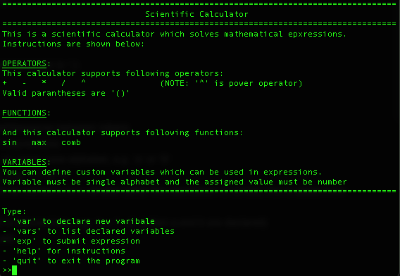

# Instructions

## Setup guide


1. This project uses Poetry, install it before use. Installation guide [here](https://python-poetry.org/docs/#installation)

2. Clone this repo or download the code, then `cd scientific-calculator`

3. Install required dependencies:

```bash
poetry install
```

## Application functionalities

To start the application, navigate to the root of the project and in terminal run:
```bash
poetry run invoke start
```  

Instructions how to use the application are shown when the application is started. Instructions can be viewed also later if the user wants so.

By using the command line UI, user can:
- submit expression to the calculator which is then solved
    - if the expression is invalid, error message will be prompted
    - valid expression are mathematical expressions containing operators; +, -, /, *, ^ and supported parantheses are '()'
        - **note** '^' is power operator
    - also following functions are supported:
        - [max()](https://docs.python.org/3/library/functions.html#max)
        - [sin()](https://docs.python.org/3/library/math.html#math.sin)
        - [comb()](https://docs.python.org/3/library/math.html#math.sin)
    - examples of valid inputs (valid decimal separator is '.'):
        - (1+1)^2
        - max(4,2) * 3
        - 1 + 2.2 - 3 / 4 * 5 ^ 6
        - **note** expressions can contain whitespaces between tokens
- declare variables which can be then used in expressions
    - variable name must be a single lower or upper case alphabet, e.g. 'a' or 'B'
    - variable name must be numeric value, e.g. '1.1' or '2'
    - also the solved expression's value can be stored in to a variable (after the expression is solved, this is asked from the user)
    - declared variabeles can be then used in expressions, e.g. 'a + 1 - b' (when a and b are declared)
- list already declared variables and their values
- list calculator instructions

Snapshot from the UI:


## Other functionalities

Tests are located in [src/tests](../src/tests/) and the tests can be executed by running:
```bash
poetry run invoke test
```
and the coverage report can be created by running:
```bash
poetry run invoke coverage-report
```

Pylint code style checking can be run by:
```bash
poetry run invoke lint
```

and the code can be automatically format to conform [PEP 8](https://peps.python.org/pep-0008/) by running (uses [autopep8](https://github.com/hhatto/autopep8)):
```bash
poetry run invoke format
```

All the tasks descibred above are specified in [tasks.py](../tasks.py)