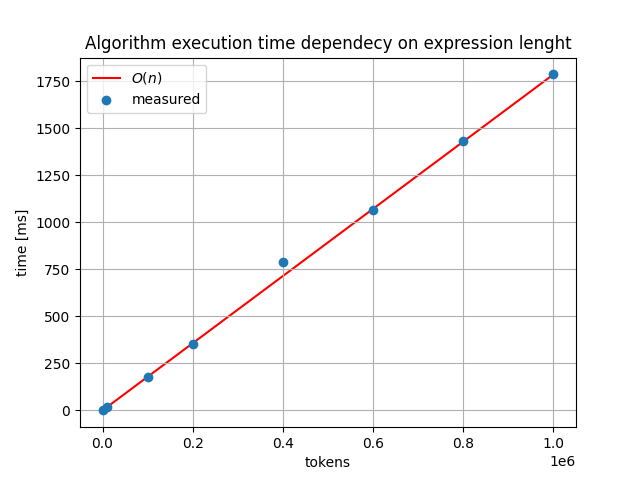

# Test document

## Coverage
Current test coverage:  
| Name                                    |    Stmts |     Miss |   Branch |   BrPart |   Cover |
|---------------------------------------- | -------: | -------: | -------: | -------: | ------: |
| src/config.py                           |        7 |        0 |        0 |        0 |    100% |
| src/entities/expression.py              |       23 |        0 |        0 |        0 |    100% |
| src/entities/operator\_stack.py         |       29 |        0 |        8 |        0 |    100% |
| src/entities/output\_queue.py           |       12 |        0 |        0 |        0 |    100% |
| src/services/calculator\_service.py     |       53 |       10 |       12 |        0 |     82% |
| src/services/parser\_service.py         |       21 |        0 |        6 |        0 |    100% |
| src/services/shunting\_yard\_service.py |       55 |        3 |       26 |        2 |     94% |
| src/services/validation\_service.py     |       71 |        4 |       25 |        4 |     92% |
|                               **TOTAL** |  **271** |   **17** |   **77** |    **6** | **93%** |
  
More detailed report can be created running `poetry run invoke coverage-report`.  

## What's been tested
Tests in [src/tests/entities/](../src/tests/entities) are mainly simple unit tests which tests that setters and getters are working properly. These simple tests are required to ensure that the basic building blocks are working as wanted. These classes doesn't contain complex logic so this level of testing is fine.  

Algorithm's calculation precision is tested in [test_shunting_yard_service.py](../src/tests/services/test_shunting_yard_service.py)

## Performance testing
By running `poetry run invoke performance` one can test how this calculator performs with different sizes of inputs. Performance tests outputs table which shows the input size, execution duration and was the expression solved correctly. Also the results are visulised in a plot:

The plot shows the execution time as function of the input length. One can see that this calculator performs in $O(n)$ .