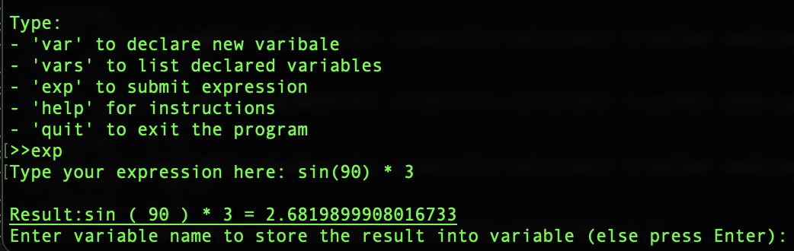
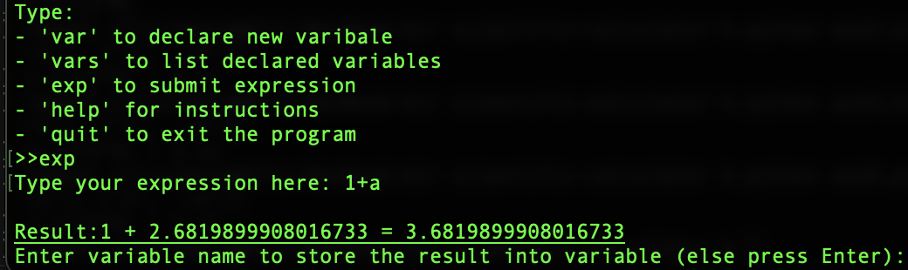

# Test document

Tests can be run with: `poetry run invoke test`.  

## Coverage
Test coverage:  

  
More detailed report can be created running `poetry run invoke coverage-report`.  

## What's been tested
Tests in [src/tests/entities/](../src/tests/entities) are mainly simple unit tests which tests that setters and getters are working properly. These simple tests are required to ensure that the basic building blocks are working as wanted. These classes doesn't contain complex logic so this level of testing is fine.  

Algorithm itself is tested in [test_shunting_yard_service.py](../src/tests/services/test_shunting_yard_service.py). It contains couple of simple tests which test that the algorithm converts the expression into correct postfix notation.

Calculator's capability to solve valid expressions correctly is tested in [test_calculator_service.py](../src/tests/services/test_calculator_service.py). Also it contains integration testing (`test_solve_calls_all_other_functions_with_correct_arguments`) and tests which validates that correct error messages are prompted with invalid expressions.  

Parsing methods are tested in [test_parser_service.py](../src/tests/services/test_parser_service.py). It is also tested that all required parsing methods are called (`test_parse_to_tokens_calls_all_submethods_with_correct_arguments`).  

All expression validations are tested in [test_validation_service.py](../src/tests/services/test_validation_service.py). Methdos are tested with valid and invalid expressions. It is also tested that all required validations are ran each time when expression is validated (`test_validate_expression_calls_all_submethods_with_correct_arguments`).

## Empirical testing

Snapshots from empirical testing:

  

  

  